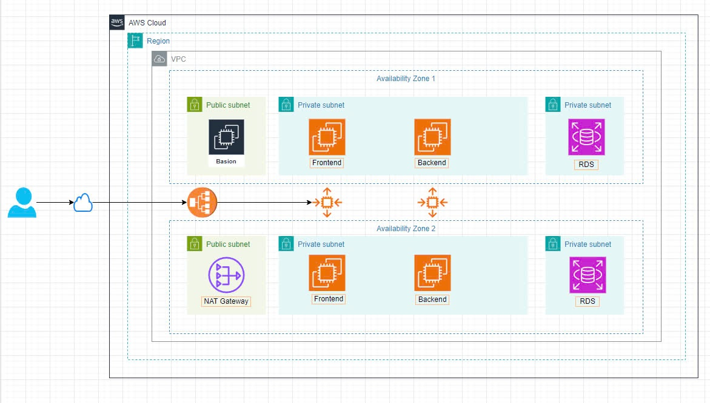
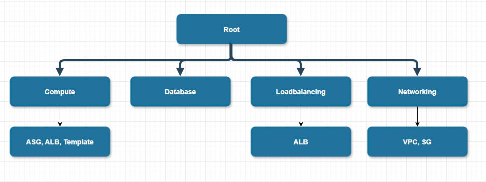
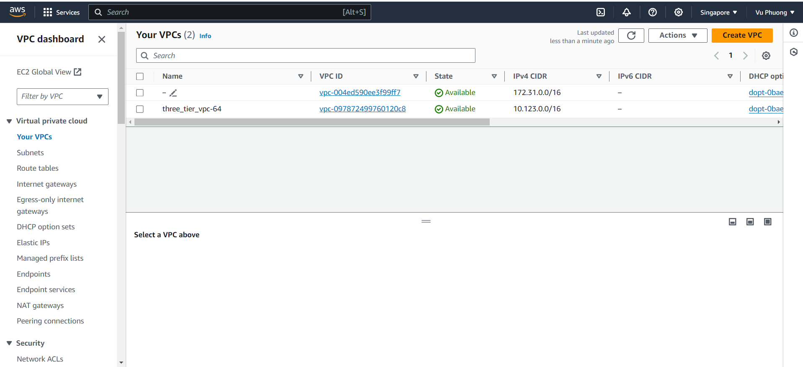
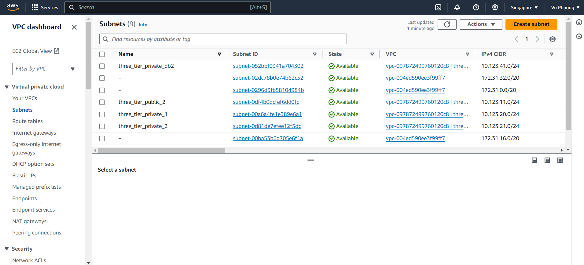
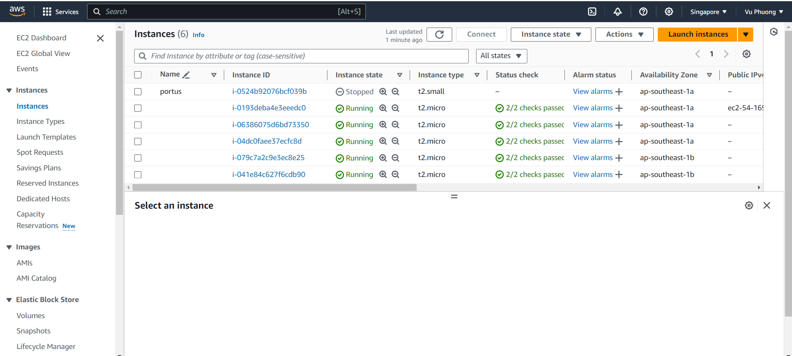
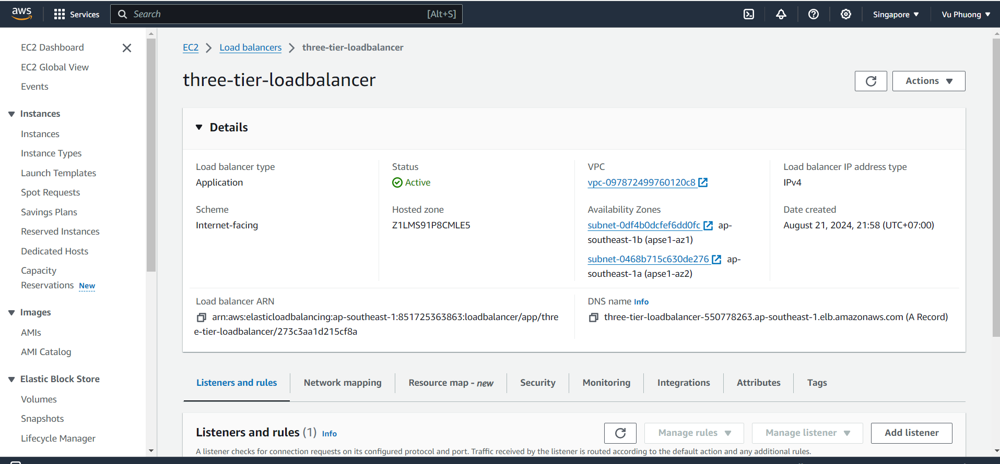
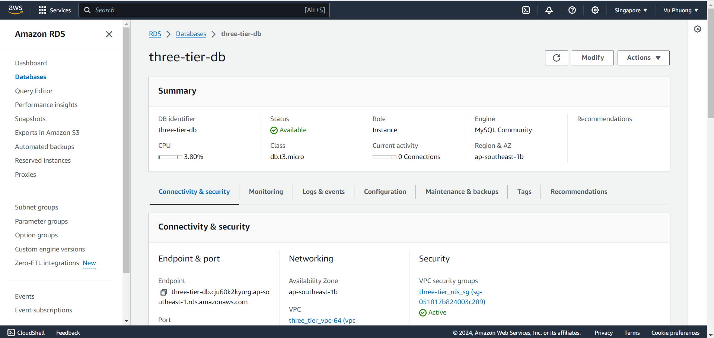

**Triển khai kiến trúc 3 lớp trên AWS với Terraform**
Kiến trúc ba tầng bao gồm tầng Web, tầng Ứng dụng và tầng Cơ sở dữ liệu trong các mạng con riêng tư với tính năng Tự động điều chỉnh quy mô cho tầng web và ứng dụng cũng như bộ cân bằng tải. Máy chủ Bastion và Nat gatway được cung cấp để cho phép ssh truy cập vào các phiên bản và truy cập internet. Các mô-đun Terraform được sử dụng để làm cho quy trình có thể lặp lại và tái sử dụng dễ dàng. Việc triển khai này sẽ tạo ra một cơ sở hạ tầng có thể mở rộng, an toàn và có tính sẵn sàng cao, tách biệt các lớp khác nhau để đảm bảo tất cả chúng đều liên lạc với nhau. Kiến trúc bao gồm Amazon Virtual Private Cloud (VPC), Elastic Load Balancer (ELB), Auto Scaling Group (ASG) và Cơ sở dữ liệu quan hệ (RDS). - Tầng Web sẽ có máy chủ đầu vào và cổng NAT được cung cấp trong các mạng con công cộng. Máy chủ đầu vào sẽ đóng vai trò là điểm truy cập của người dùng vào cơ sở hạ tầng cơ bản. Cổng NAT sẽ cho phép các mạng con riêng tư của chúng tôi giao tiếp với Internet trong khi vẫn duy trì mức độ bảo mật bằng cách ẩn địa chỉ IP riêng tư của các phiên bản riêng tư khỏi Internet công cộng. - Ở tầng Ứng dụng, một bộ cân bằng tải hướng lưu lượng truy cập Internet đến nhóm tự động điều chỉnh trong các mạng con riêng tư, cùng với nhóm tự động điều chỉnh phụ trợ cho ứng dụng phụ trợ của chúng tôi. Chúng tôi sẽ tạo một tập lệnh để cài đặt máy chủ web apache ở giao diện người dùng và một tập lệnh để cài đặt Node.js ở phần phụ trợ. - Trong tầng Cơ sở dữ liệu, chúng ta sẽ có một lớp mạng con riêng tư khác lưu trữ cơ sở dữ liệu MySQL mà cuối cùng sẽ được truy cập bằng Node.js..

***Cấu trúc cơ sở hệ thống***


***Cấu trúc thư mục***
```
|---modules
    |---compute
        |---main.tf
        |---outputs.tf
        |---variables.tf
    |---database
        |---main.tf
        |---outputs.tf
        |---variables.tf
    |---database
        |---main.tf
        |---outputs.tf
        |---variables.tf
    |---networking
        |---main.tf
        |---outputs.tf
        |---variables.tf
|---terraform
    |---backend.tf
    |---main.tf
    |---output.tf
    |---terraform.tfvars
    |---variables.tf
```
## BẮT BUỘC:
Trước khi bắt đầu triển khai dự án cần chuẩn bị
1. Tài khoản AWS ( Access key ID và Secret key ID)
2. Cần cài đặt Terraform ở máy local triển khai dự án lên cloud AWS
3. Cần cài đặt AWS CLI để triển khai

## CÁC BƯỚC THỰC HIỆN

### Bước 1: Clone source code về máy của mình
### Bước 2: Cấu hình thông tin tài khoản AWS
1. Mở AWS Management Console trên trình duyệt
2. Truy cập vào IAM
3. Tạo tài khoản người dùng **IAM** để có quyền truy cập
4. Thêm quyền cho user IAM vừa tạo như 
4. Assign the necessary permissions to the IAM user, such as `AmazonEC2FullAccess`, `AmazonRDSFullAccess`, `AmazonVPCFullAccess`, and `ElasticLoadBalancingFullAccess`, `SSM Parametter`, `AmazonS3FullAccess`.
Đối với quyền thực thi `SSM Parametter`, bạn có thể add thêm vào như sau:
```
{
  "Version": "2012-10-17",
  "Statement": [
    {
      "Effect": "Allow",
      "Action": "ssm:GetParameter",
      "Resource": "arn:aws:ssm:ap-southeast-1::parameter/aws/service/ami-amazon-linux-latest/amzn2-ami-hvm-x86_64-gp2"
    }
  ]
}
```
5. Tạo Access key ID và Secret access key cho user **IAM**
6. Cấu hình AWS CLI với user **IAM** vừa tạo
```
aws configure
```

### Bước 3: Cấu hình S3
1. Đăng nhập AWS account
2. Chọn dịch vụ Amazon S3
3. Tạo "Create Bucket" và cấu hình đơn giản
4. Có thể tùy chỉnh bật thêm các tính năng
5. Review và chọn Create Bucket

**Lưu ý**
Cần cấu hình thêm để user **IAM** có quyền trên S3
```
{
  "Version": "2012-10-17",
  "Statement": [
    {
      "Effect": "Allow",
      "Principal": {
        "AWS": "arn:aws:iam::YOUR_AWS_ACCOUNT_ID:user/YOUR_USERNAME"
      },
      "Action": [
        "s3:GetObject",
        "s3:PutObject",
        "s3:DeleteObject"
      ],
      "Resource": "arn:aws:s3:::<tên bucket>/*"
    }
  ]
}
```

### Bước 4: Cấu hình thông tin Database trong Terraform

Mình đã tạo sẵn file "terraform.tfvars" cho mọi người. Mọi người có thể tùy chỉnh thông tin của database

### Bước 5: Khởi tạo Terraform
```
terraform init
```

**Khi muốn chạy lại cấu hình cho terraform**
```
terraform init -reconfigure
```

### Bước 6: Kiểm tra và xác thực cấu hình

Để kiểm tra xác thực với câu lệnh
```
terraform plan
```
Khi kiểm tra, chúng ta có thể biết được những thành phần nào được tạo mới

### Bước 7: Triển khai dự án lên cơ sở hạ tầng AWS

Thực hiện với câu lệnh
```
terraform apply
```

Khi khởi tạo, terraform sẽ yêu cầu xác thực bằng cách nhập "yes" hoặc chúng ta có thể chạy với câu lệnh
```
terraform apply -auto-approve
```

### Bước 8: Kiểm tra

Khi muốn chắc dự án đã khởi tạo thành công, chúng ta có thể truy cập vào Load Balancing để lấy DNS để test thử

### Bước 9: Hủy bỏ cơ sở hạ tầng ( tùy chọn)

Sau khi chúng ta đã triển khai thành công dự án ở trên, có thể hủy bỏ với câu lệnh
```
terraform destroy
```
Hoặc
```
terraform destroy -auto-approve
```

### Bước 10: Xác thực hệ thống đã khởi tạo

Chúng ta có thể truy cập vào AWS Console để xem các thuộc tính như VPC và Subnets, Internet Gateway, EC2 Instance,...







## Chúc mọi người có thể triển khai thành công dự án với cấu trúc 3 lớp như trên


